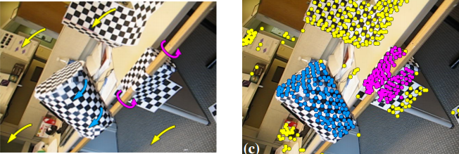
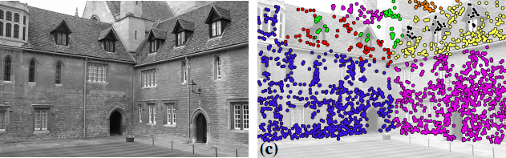
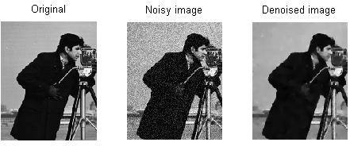
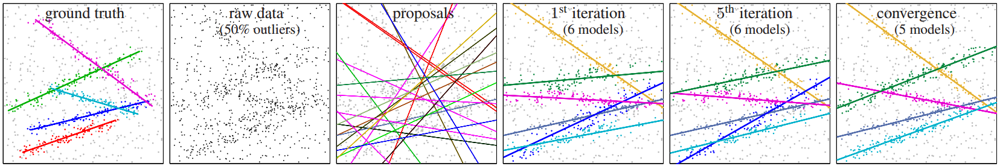
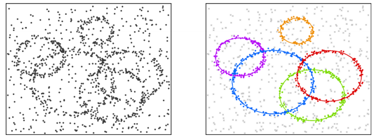

Optimization in Computer Vision
===============================

----

**Optimization** in Computer Vision
===================================

----

board

----

#. search space 
#. function
#. minimization strategy

----

1- Search space  --> My solution space

2- Function      --> Design 

3- Minimization strategy

   - Brute force
   - Algebra
   - Calculus

     * Gauss-Newton Optimization
     * Simplex  Optimization
     * Stochastic Optimization
     * Combinatorial Optimization

----

Optimization in **Computer Vision**
===================================

----

Optimization in **Computer Vision**
===================================

Motion Segmentation
-------------------

----

Optimization in **Computer Vision**
===================================

Planar Homography Estimation
----------------------------

----

Optimization in **Computer Vision**
===================================

Image Segmentation
------------------

Image Segmentation
------------------

----

Optimization in **Computer Vision**
===================================

Model Fitting
-------------

----

This is a first slide
=====================

Restructured text takes any line that is underlines with punctuation and
makes it into a heading. Each type of undeline will be made into a different
level of heading, but it is not the type that is important, but rather the
order of which each type will be enountered.

So in this presentation, lines underlined with equal (=) characters will be
made into a first-level (H1) heading.

----

First header
============

You can choose other punctuation characters as your level 1 heading if you like,
but this is the most common. Any if these character works::

    = - ` : ' " ~ ^ _ * + # < > .

Second header
-------------

Third header
............

The drawback with reStructuredText is that you can't skip levels. You can't
go directly from level 1 to level 3 without having a level 2 in between.
If you do you get an error::

    Title level inconsistent

----

Other formatting
================

All the normal reStructuredText functions are supported in Hovercraft!

- Such as bulletlists, which start with a dash (-) or an asterisk (*).
  You can have many lines of text in one bullet if you indent the
  following lines.

   - And you can have many levels of bullets.
   
       - Like this.
    
- There is *Emphasis* and **strong emphasis**, rendered as <em> and <strong>.

----

More formatting
===============

#. Numbered lists is of course also supported.

#. They are automatically numbered.

#. But only for single-level lists and single rows of text.

#. ``inline literals``, rendered as <tt> and usually shown with a monospace font, which is good for source code.

#. Hyperlinks, like Python_

.. _Python: http://www.python.org

