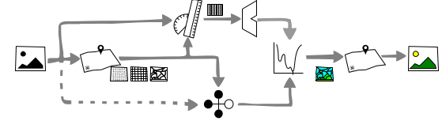
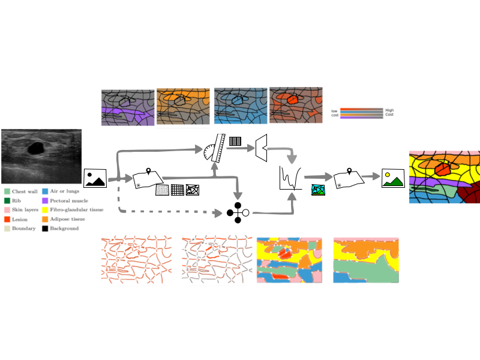

Optimization in Computer Vision
===============================

----

**Optimization** in Computer Vision
===================================

----

**Optimization** in Computer Vision
===================================

#. search space 
#. function
#. minimization strategy

----

**Optimization** in Computer Vision
===================================

1- Search space  --> My solution space

2- Function      --> Design 

3- Minimization strategy

   - Brute force
   - Algebra
   - Calculus

     * Gauss-Newton Optimization
     * Simplex  Optimization
     * Stochastic Optimization
     * Combinatorial Optimization

----

Optimization in **Computer Vision**
===================================

----

Optimization in **Computer Vision**
===================================

Motion Segmentation
-------------------

.. figure:: ./images/motionSeg.png

----

Optimization in **Computer Vision**
===================================

Planar Homography Estimation
----------------------------

.. figure:: ./images/plannarHomography.png

----

Optimization in **Computer Vision**
===================================

Model Fitting
-------------

.. figure:: ./images/modelFittingA.png
   :height: 139px

.. figure:: ./images/modelFittingB.png

----

Optimization in **Computer Vision**
===================================

Image Segmentation
------------------

.. figure:: ./images/imageSegmentation.png

Image Segmentation
------------------

.. figure:: ./images/imDenoising.png

----

Energy (or Cost) Based Segmentation
===================================

----

Energy (or Cost) Based Segmentation
===================================

----

Energy (or Cost) Based Segmentation
===================================

1- Search space  --> My solution space

2- Function      --> Design 

3- Minimization strategy

   - Brute force
   - Algebra
   - Calculus

     * Gauss-Newton Optimization
     * Simplex  Optimization
     * Stochastic Optimization
     * Combinatorial Optimization

----

**What** is this Energy (or Cost)
=================================

----

Cristal Clear. **F*c#**
=======================

----

From an applied point of view
=============================

----

From an applied point of view
=============================

----

ok, but **HOW** ?
=================

----

Data term construction
======================

* Heuristic

* Build a **stochastic** model

----

Data term from a stochastic model
=================================

* Features

* Classifier
  
* Training policy

----

Pair-wise term
==============

----

Fine, but I still don't have my **SOLUTION**
============================================

----

Simulate Annealing and Graph-Cuts
=================================

----

Recap.
======

----

Translation to other problems (Image Denoising)
===============================================

----

The nail and the Hammer
=======================
